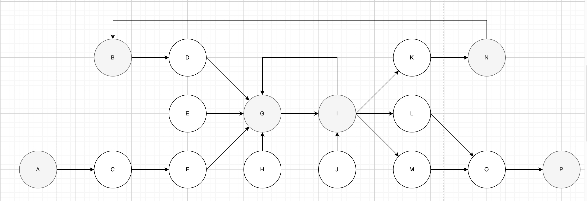
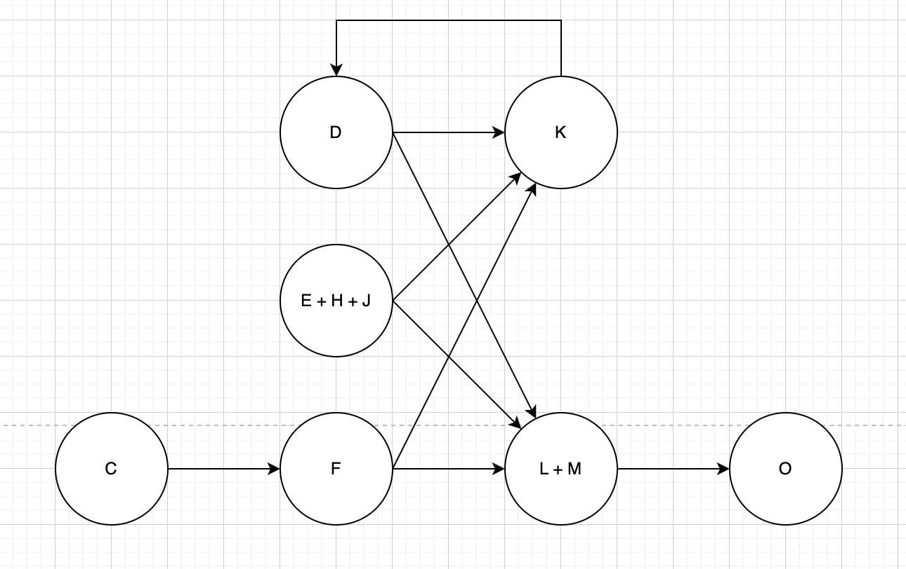

# Network Collapse Code Task

## Overview

This code task requires you to implement the `collapse` function, which transforms a given network structure (`input`) into a new network (`target`) by applying a set of collapse rules. The function will be tested against expected results to ensure correctness.

## Collapse Rules

When collapsing the network, the following rules must be applied:

1. **Exclude Virtual Vertices**: Any virtual vertices present in the input network should not be included in the output.
2. **Inherit Parent-Child Relationships**: When a virtual vertex is removed, its children should inherit its parents, and vice versa.
3. **Merge Identical Vertices**: Any vertices with the same set of parents and children should be collapsed into a single vertex.
4. **Naming Convention**: The name of a collapsed vertex should be the concatenation of all merged vertex names, sorted in ascending order.
   - Example: If vertices `J`, `H`, and `E` are merged, the resulting vertex should be named `"EHJ"`.

## Example

### Input


_Gray vertices are considered virtual_

### Expecgted Output



## Implementation

Your task is to complete the `collapse` function:

```javascript
function collapse(id, network, target) {
  // TODO: Implement collapse logic
}
```

### Inputs

- `id` (String): The starting vertex name.
- `network` (Network): The input network containing vertices and connections.
- `target` (Network): An initially empty network where the transformed structure should be stored.

### Outputs

- The `target` network should be modified in place to reflect the collapsed structure.

## Running Tests

The provided code iterates over all vertices in the `input` network and tests the `collapse` function:

```javascript
input.iterate().map((vertex) => {
  const actual = new Network();
  collapse(vertex.name, input, actual);
  expect(expected, actual);
  console.log(`Test for initial vertex '${vertex.name}' is correct!`);
});
```

To verify your implementation:

1. Run the script.
2. Ensure all test cases pass (i.e., "Test for initial vertex 'X' is correct!" appears for each vertex).

## Files

- `input.js`: Defines the test input network.
- `expected.js`: Contains the expected collapsed network.
- `network.js`: Implements the `Network` class used to represent the graphs.
- `comparator.js`: Provides an `expect` function to validate your output.

## Notes

- Be mindful of infinite loops when modifying parent-child relationships.
- Sorting vertex names correctly is essential for consistency.
